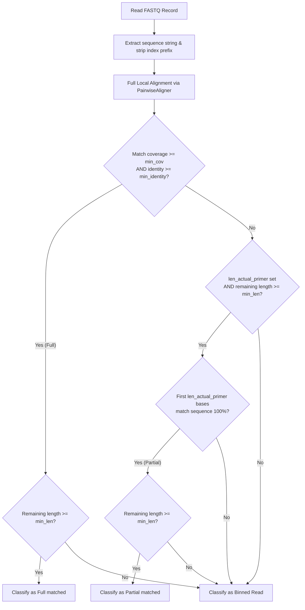

# Pipeline Logic & Algorithmic Details

This document explains the algorithms, matching criteria, and processing steps implemented in the `pise` preprocessing pipeline.

---

## 0. Quality Control & Demultiplexing Step

Before reads are filtered, an optional Quality Control & Demultiplexing step is executed:
- **Scope**: Enabled or disabled via a boolean `qc` option (default `True`). It runs exclusively on forward reads.
- **Functionality**:
  - Parses the input forward FASTQ file using a fast 4-line parsing method.
  - Drops **poly-N reads** (sequences consisting entirely of 'N' characters).
  - Extracts the 8-bp i5 index sequence prefix if `index_i5` is `True`.
  - Demultiplexes reads into up to 5 bins: 4 bins for known IS index sequences from `primers.fasta` and 1 bin for unknown index sequences (`index-unknown`). If `index_i5` is `False` or only 1 index type is detected, all reads route to a single `non-polyN` category.
  - Calculates length distribution, quality score sums, and index frequencies to build a comprehensive HTML report saved in `qc_reports/`.
- **Outputs**:
  - Added to the summary file `pise_summary.tsv` under the columns `QC_Total_Forward_Reads` and `QC_PolyN_Forward_Reads`.
  - Creates demultiplexed FASTQ files in `filtered_reads/` as inputs to the filtering stage.

---

## 1. Reads Filtering Algorithm

The core filtering step (implemented in `pise/filter_reads.py`) processes paired-end FASTQ reads to extract sequences containing the target IS-element HEAD/TAIL boundary sequences.

### Algorithmic Parameters
- **i5 Index Offset (`index_i5`)**: A boolean flag. If `True`, the first `8` bases of each forward read sequence are skipped (derived `index_len = 8`) to bypass the i5 barcode index sequence offset. If `False`, `index_len = 0`.
- **Minimum Coverage (`min_cov`)**: The fraction of the target sequence length that must be covered by the local alignment.
- **Minimum Identity (`min_identity`)**: The alignment identity score (matches divided by total aligned length).
- **Minimum Remaining Length (`min_len`)**: The required length of the genomic DNA portion of the read following the matched sequence.
- **Length of Actual Primer (`len_actual_primer`)**: The length of the core prefix of the HEAD/TAIL sequence used for 100% exact-match rescue if the full alignment fails.

### Step-by-Step Logic

#### Step 1.1: Index Offset
For each forward read sequence $S$:
$$S_{\text{head}} = S[index\_len : index\_len + len(P) + 5]$$
where $index\_len = 8$ if $index\_i5$ is True else $0$, and $P$ is the target sequence (either `HEAD` or `TAIL`).

#### Step 1.2: Local Alignment
Full local pairwise alignment is performed between the target sequence $P$ and the read head $S_{\text{head}}$ using `Bio.Align.PairwiseAligner` with scores:
- Match: `+1.0`
- Mismatch: `-1.0`
- Gap: `-1.0`

The alignment returns the start ($start_{\text{target}}$) and end ($end_{\text{target}}$) coordinates of the alignment on the target sequence.
- **Coverage**:
  $$\text{cov} = \frac{end_{\text{target}} - start_{\text{target}}}{len(P)}$$
- **Identity**:
  $$\text{identity} = \frac{\text{identities}}{\text{identities} + \text{mismatches} + \text{gaps}}$$

#### Step 1.3: Classification & Rescue
1. **Full Match (Criterion 1)**: If $\text{cov} \ge min\_cov$ and $\text{identity} \ge min\_identity$, the read is classified as a full match.
2. **Rescue Rule (Criterion 1 & 2 combined)**: If full match fails, but `len_actual_primer` is defined, the remaining sequence length after a potential full alignment is check-validated ($\ge min\_len$). Then, the sub-sequence of the read head starting at the index offset of length `len_actual_primer` is compared:
   $$S[index\_len : index\_len + len\_actual\_primer] == P[:len\_actual\_primer]$$
   If it is a 100% exact match, it is classified as a partial match.
3. **Genomic Portion Check (Criterion 2)**: The remaining genomic portion of the read is calculated:
   $$\text{length}_{\text{remaining}} = len(S) - (index\_len + end_{\text{target}})$$
   If $\text{length}_{\text{remaining}} \ge min\_len$, the read passes and is written to the appropriate output FASTQ (`_full.fastq.gz` or `_partial.fastq.gz`). Otherwise, it goes to `_bin.fastq.gz`.

---

## 2. Reverse Reads Pairing (Deferred)

Since IS-Seq uses paired-end sequencing, the reverse reads must match the filtered forward reads. Rather than running both simultaneously, the reverse matching is deferred to a separate script `pise/extract_pairs.py`:
- **Method**: The forward filtering stage generates `_full.fastq.gz` and `_partial.fastq.gz` files containing the filtered forward reads.
- **Processing**: The `extract_pairs.py` script reads the filtered forward reads file, collects the set of passed read IDs, and scans the raw reverse FASTQ read file sequentially. For any reverse read matching a forward read ID, it writes it to the output reverse FASTQ file.
- **Complexity**: $O(N)$ to build the lookup set of forward IDs, and $O(1)$ lookup complexity per read when scanning the reverse FASTQ. This ensures the output reverse files match the filtered forward files exactly.

---

## 3. Parallel Processing & Resource Optimization

The pipeline utilizes two distinct levels of parallel processing to maximize resource utilization and avoid nested multiprocessing bottlenecks:

1. **Sample-level Parallel QC (Phase 1)**: QC and demultiplexing are parallelized across samples using `concurrent.futures.ProcessPoolExecutor` in `pise/main.py`. This submits multiple `run_qc` runs concurrently.
2. **Batch-level Parallel Filtering (Phase 2)**: Filtering is run sequentially per sample, but internally parallelized across reads within each file using `multiprocessing.Pool`.
   - **Batching**: Read streams are parsed and chunked into batches of 5000 records.
   - **Serialization**: Read records are serialized as basic python tuples rather than heavy `Bio.SeqRecord` objects, minimizing inter-process communication overhead.
   - **Order Preservation**: The worker pool uses `.imap` which preserves the exact order of the original reads file in the output filtered FASTQ.
   - **Unknown Index Skipping**: To conserve CPU resources, filtering is automatically skipped for demultiplexed files labeled as `index-unknown`.
