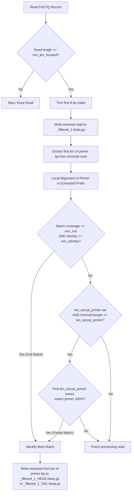

# Pipeline Logic & Algorithmic Details

This document explains the algorithms, matching criteria, and processing steps implemented in the `islan` preprocessing pipeline.

---

## 0. Quality Control & Demultiplexing Step

Before reads are filtered, an optional Quality Control & Demultiplexing step is executed:
- **Scope**: Enabled or disabled via a boolean `qc` option (default `True`). It runs exclusively on forward reads.
- **Functionality**:
  - Parses the input forward FASTQ file using a fast 4-line parsing method.
  - Drops **poly-N reads** (sequences consisting entirely of 'N' characters).
  - Extracts the 8-bp i5 index sequence prefix if `index_i5` is `True`.
  - Demultiplexes reads using Hamming distance index matching (distance $\le$ `i5-mismatch` tolerance, default 2) based on the known indices in `primers.fasta`.
  - Reads matching known indices are written to `demux_reads/{sample}_index-{IS_element}_1.fastq.gz`. Reads that do not match any known index are written to `demux_reads/{sample}_index-undetermined_1.fastq.gz`.
  - Calculates sample index status based on demultiplexing counts:
    - **`Index failure`**: Expected index reads account for < 30% of total non-poly-N reads. (Downstream filtering for this sample is automatically skipped).
    - **`Index warning`**: Expected index reads account for $\ge$ 30% of total non-poly-N reads, but another index category also accounts for $\ge$ 30%.
    - **`Index OK`**: Expected index reads account for $\ge$ 30% of total non-poly-N reads, and no other category accounts for $\ge$ 30%.
- **Outputs**:
  - Added to the summary file `islan_summary.tsv` under the columns: `Sample_Index`, `IS_element`, `QC_Total_Forward_Reads`, `QC_PolyN_Forward_Reads`, `QC_Undetermined_Forward_Reads`, `QC_NonPolyN_Forward_Reads`, `Filtering_Status`.
  - Creates demultiplexed FASTQ files in `demux_reads/` as inputs to the filtering stage.

---

## 1. Reads Filtering & Trimming Algorithm

The core filtering step (implemented in `islan/filter_reads.py`) processes forward reads to trim the index, output filtered forward reads, and extract HEAD/TAIL segments.

### Algorithmic Parameters
- **INDEX_LEN (8 bp)**: The first 8 bases of each forward read sequence are trimmed to remove the i5 barcode index.
- **Minimum Length Forward (`min_len_forward`)**: Computed as `INDEX_LEN (8bp) + MAX(len(HEAD), len(TAIL)) + min_len (default 20bp)`. Skip reads that are shorter than `min_len_forward`.
- **Minimum Coverage (`min_cov`)**: The fraction of the target sequence length that must be covered by the local alignment.
- **Minimum Identity (`min_identity`)**: The alignment identity score (matches divided by total aligned length).
- **Length of Actual Primer (`len_actual_primer`)**: The length of the core prefix of the HEAD/TAIL sequence used for 100% exact-match partial matching if the full alignment fails.

### Step-by-Step Logic

#### Step 1.1: Trimming and Length Filtering
For each forward read sequence $S$ and quality score $Q$:
1. If $len(S) < min\_len\_forward$, the read is skipped.
2. Trim the first 8 bp:
   $$S_{trimmed} = S[8:]$$
   $$Q_{trimmed} = Q[8:]$$
3. Write $S_{trimmed}$ and $Q_{trimmed}$ to the output `{sample}_filtered_1.fastq.gz` file.

#### Step 1.2: Local Alignment & Matching
For each target primer $P$ (HEAD or TAIL) of length $L_P$:
1. Extract the first $L_P$ bases of the trimmed read:
   $$S_{head} = S_{trimmed}[:L_P]$$
2. Perform local pairwise alignment between $P$ and $S_{head}$ using `Bio.Align.PairwiseAligner` with scores: Match: `+1.0`, Mismatch: `-1.0`, Gap: `-1.0`.
3. Check **Full Match**:
   $$\text{cov} = \frac{end_{\text{target}} - start_{\text{target}}}{L_P} \ge min\_cov$$
   $$\text{identity} = \frac{\text{identities}}{\text{identities} + \text{mismatches} + \text{gaps}} \ge min\_identity$$
4. Check **Partial Match**: If Full Match fails and `len_actual_primer` is defined, check if:
   $$S_{trimmed}[:len\_actual\_primer] == P[:len\_actual\_primer]$$
   If so, it is classified as a partial match with a score equivalent to `len_actual_primer`.
5. If a match is found, the best-scoring match (HEAD or TAIL) is selected.
6. The exact first $L_P$ bp of the trimmed sequence ($S_{trimmed}[:L_P]$) and its quality scores ($Q_{trimmed}[:L_P]$) are written to `{sample}_filtered_1_HEAD.fastq.gz` or `{sample}_filtered_1_TAIL.fastq.gz`.

---

## 2. Reverse Reads Pairing (Deferred)

Since IS-Seq uses paired-end sequencing, the reverse reads must match the filtered forward reads. Rather than running both simultaneously, the reverse matching is deferred to a separate script `islan/extract_pairs.py`:
- **Method**: The forward filtering stage generates `{sample}_filtered_1.fastq.gz` containing the filtered forward reads.
- **Processing**: The `extract_pairs.py` script reads the forward FASTQ file (or a plain text file of read IDs), collects the set of passed read IDs, and scans the raw reverse FASTQ read file sequentially. For any reverse read matching a forward read ID, it writes it to the output reverse FASTQ file.
- **Complexity**: $O(N)$ to build the lookup set of forward IDs, and $O(1)$ lookup complexity per read when scanning the reverse FASTQ. This ensures the output reverse files match the filtered forward files exactly.

---

## 3. Parallel Processing & Resource Optimization

The pipeline utilizes two distinct levels of parallel processing to maximize resource utilization and avoid nested multiprocessing bottlenecks:

1. **Sample-level Parallel QC (Phase 1)**: QC and demultiplexing are parallelized across samples using `concurrent.futures.ProcessPoolExecutor` in `islan/main.py`. This submits multiple `run_qc` runs concurrently.
2. **Batch-level Parallel Filtering (Phase 2)**: Filtering is run sequentially per sample, but internally parallelized across reads within each file using `multiprocessing.Pool`.
   - **Batching**: Read streams are parsed and chunked into batches of 5000 records.
   - **Serialization**: Read records are serialized as basic python tuples rather than heavy `Bio.SeqRecord` objects, minimizing inter-process communication overhead.
   - **Order Preservation**: The worker pool uses `.imap` which preserves the exact order of the original reads file in the output filtered FASTQ.
   - **Index Failure Skipping**: To conserve CPU resources, filtering is automatically skipped for samples categorized as `Index failure`.

---

## 4. IS Mapping & Tandem Classification Algorithm (`islan is-mapping`)

The mapping stage aligns preprocessed reads to the reference sequence and uses a 3-stage coordinate pairing logic to characterize insertions.

### Step 4.1: Reference Guided Target Scan (Stage 1)
1. Target elements with suffix `:FULL` in [targets.fasta](file:///data/SiNguyen/1.SIXTEEN/IS-SEQ/PISE/config/targets.fasta) are aligned against the reference using `bwa mem -a`.
2. Precise genomic start, end, and orientation boundaries are stored for each known target copy.
3. Flanking `HEAD` and `TAIL` peaks within a `--flank-len` (default 300 bp) window around these boundaries are paired and flagged as `Known Pair` hits.

### Step 4.2: Novel Insertion & Tandem Characterization (Stage 2)
Active un-paired peaks are resolved using coordinate overlap definitions and centralized constants:
- **Tandem Same-Direction (`++` or `--`)**: `l_peak_1` (HEAD) partially overlaps central fully overlapping pair `[r_peak_1, l_peak_2]`, which partially overlaps `r_peak_2` (TAIL).
- **Tandem Opposite-Direction (`+-`)**: Multiple `HEAD` peaks (`lp1`, `lp2`) partially overlap a single central `rpN` (TAIL).
- **Tandem Opposite-Direction (`-+`)**: Multiple `TAIL` peaks (`rp1`, `rp2`) partially overlap a single central `lpN` (HEAD).
- **Novel Pair (TSD)**: Remaining `HEAD` and `TAIL` peaks partially overlap. The overlap size must be less than `MAX_PAIRING_DISTANCE` (default: 100 bp). If the overlap exceeds `MAX_TSD_OVERLAP` (default: 20 bp), the call is flagged with a `*` suffix (e.g. `novel (TSD)*`) to indicate possible false positives.
- **Novel Pair (Standard)**: Remaining `HEAD` and `TAIL` peaks do not overlap but are within `MAX_PAIRING_DISTANCE` (default: 100 bp) gap distance.

### Step 4.3: Noise and Singleton Resolution (Stage 3)
- **PCR Off-Target Noise**: Remaining `HEAD` and `TAIL` peaks that fully overlap (containment ratio $> 90\%$) are classified as `Off-Target Amplicon (Noise)`.
- **Singletons**: Remaining un-paired peaks are classified as `HEAD-only` or `TAIL-only` singletons.
- **Output Split**: Paired hits (Stages 1 and 2) are written to `{sample}_table.tsv` with flanking gene annotations. Singletons and Noise are written to `{sample}_unpaired.tsv` with gene columns omitted. Depth stats are reported as median and IQR.
