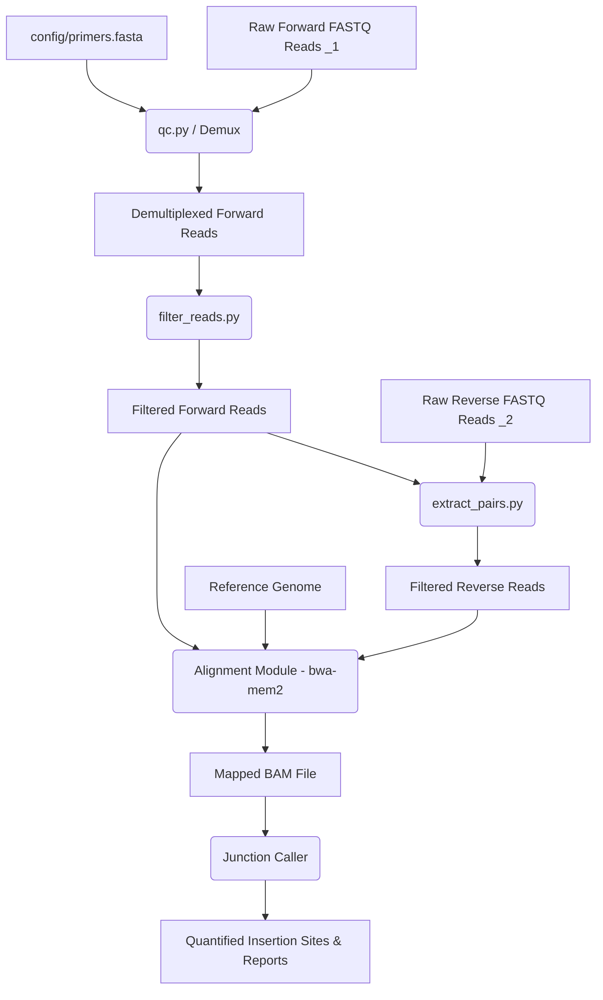

# Pipeline Architecture & Data Flow

This document details the modular architecture of the IS-Seq analysis pipeline.

## Modular Component Diagram



## Configuration Schema (`config.yaml`)
The pipeline parameterizes its modules via `config/config.yaml`. The schema is defined as:

```yaml
# Path to the primers database file
primers_file: "config/primers.fasta"

# Main pipeline output directory
output_dir: "results_asv"

# Preprocessing Step Parameters
preprocessing:
  min_cov: 0.9
  min_identity: 0.9
  min_len: 20
  index_i5: true
  i5_mismatch: 2
  len_actual_primer: 20 # Optional, set to integer to enable partial match
  threads: 8 # Number of parallel processes to use for read filtering
  qc: true # Enable/disable QC and demultiplexing step (default: true)

# Alignment Step Parameters (Future)
alignment:
  reference_genome: "data/reference/genome.fasta"
  threads: 4
  bwa_mem2_path: "bwa-mem2"
```
