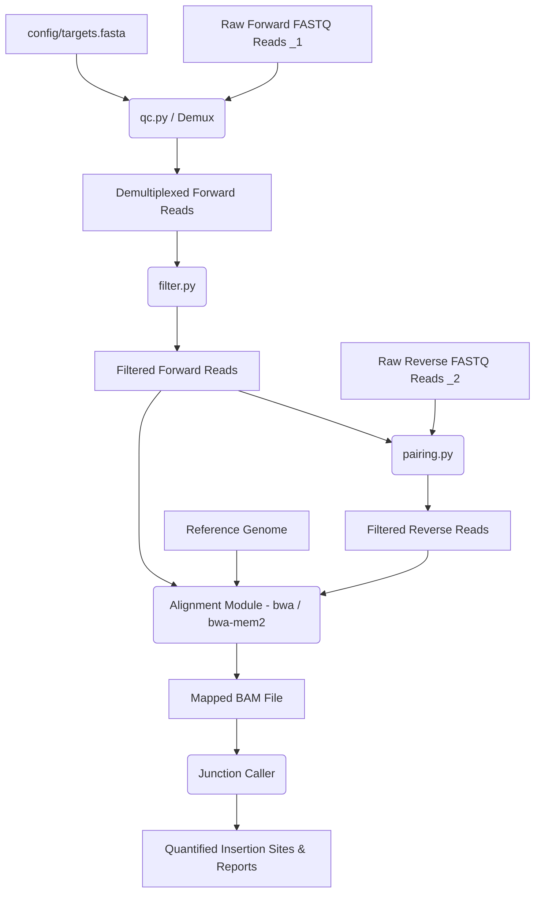

# Pipeline Architecture & Data Flow

This document details the modular architecture of the IS-Seq analysis pipeline.

## Modular Component Diagram



## Configuration Schema (`config.yaml`)
The pipeline parameterizes its modules via `config/config.yaml`. The schema is defined as:

```yaml
# Path to the targets database file.
# Used as the IS element registry source by ALL modules (is-mapping + pre-process).
targets_file: "config/targets.fasta"

# Main pipeline output directory
output_dir: "results_asv"

# Preprocessing parameters (islan pre-process)
preprocessing:
  min_cov: 0.9            # Minimum alignment coverage fraction for primer match
  min_identity: 0.9       # Minimum alignment identity for primer match
  min_len: 20             # Minimum read length after index trim (bp)
  index_i5: true          # Trim 8 bp i5 index from forward reads
  i5_mismatch: 2          # Hamming distance tolerance for i5 demultiplexing
  len_actual_primer: 20   # Core prefix length for partial exact matching (bp); set to null to disable
  threads: 8              # Parallel processes for read filtering
  qc: true                # Run QC and demultiplexing step on forward reads

# IS Mapping parameters (islan is-mapping)
is_mapping:
  # IS element short name to target (e.g. ISKpn26).
  # Restricts the known-IS reference scan to this element only.
  # Leave null to scan all IS elements in targets_file.
  is_name: null
  min_depth: 6            # Minimum read depth to report an insertion site
  merging: 100            # Bedtools merge distance for peak calling (bp)
  min_mapq: 30            # Min mapping quality (0 retains multi-mappers; discards 0 < MAPQ < min_mapq)
  flank_len: 300          # Flanking window around known IS boundaries (bp)
  threads: 8              # Threads for BWA and samtools
```

